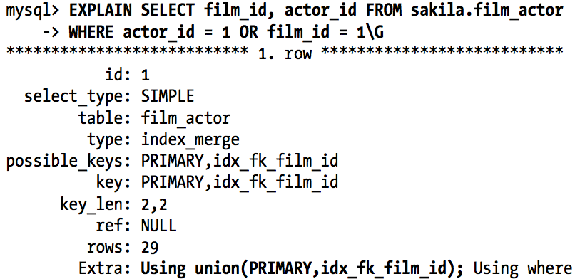

# MySQL 索引笔记

Creating truly optimal indexes often requires you to rewrite your queries.

## Notice
- If you index more than one column, the column order is very important, 
because MySQL can only search efficiently on a leftmost prefix of the index.
- ORM vs. index
    >ORMs produce logically and syntactically correct queries (most of the time), 
    but they rarely produce index-friendly queries unless you use them 
    for only the basic types of queries,such as primary key lookups.

### typical index types
Indexes are implemented in storage engine layer not the server layer,thus 
they may work differently in different engines.
the below are not the all index types:
-  B-Tree. 
    Useful for the following kinds of queries:
    - Match the full value
    - Match a leftmost prefix (leftmost part of multicolumn index)
    - Match a column prefix (like 'xxx%')
    - Match a range
    - **Match a part exactly and range on another part**
        This index can help you find everyone whose last name is Allen and whose first name starts with the letter K (Kim, Karl, etc.). This is an exact match on last_ name and a range query on first_name.
    - Index only queries (Covering index query)

  >MyISAM uses a prefix compression technique that makes indexes smaller, but
  InnoDB leaves values uncompressed in its indexes. Also,MyISAM refers to indexed rows
  by their physical locations, but InnoDB refers to indexed rows by primary key values.

-  Full text indexes
- Spatial indexes(空间索引，支持不够好不如PostGIS)
- Hash indexes
    - In MySQL, only the Memory storage engine supports explicit 
    hash indexes. They are the default index type for Memory tables,
    thouth Memory tables can have B-Tree indexes too.
    - You can emulate hash index yourself.example
        >增加一个column作为hash column 使用适合的hash函数来计算hash，
        使用trigger来更新hash（当row被insert or update时）.hash 函数要返回整型.

        >mysql>SELECT id FROM url WHERE url="http://www.mysql.com”;

        >mysql> SELECT id FROM url WHERE url="http://www.mysql.com" 
        AND url_crc=CRC32("http://www.mysql.com”);

## Indexing Strategies for High Performance
### Isolating the column
“Isolating”means it should not be part of an expression or be inside 
a function in the query.Here’s an example of a common mistake:

>mysql> SELECT ... WHERE TO_DAYS(CURRENT_DATE) - TO_DAYS(date_col) <= 10;

### Prefix Indexes and index selectivity
Sometimes you need to index very long character columns, which makes 
your index large and slow. 
- One strategy is to emulate Hash type 
- You can often save space and get good performance by indexing the
 first few characters instead of the whole value.
 This makes your indexes use less space, but it also makes them 
less selective.A prefix of the column is often selective enough to give
good performance.The trick is to choose a prefix that’s long enough to
give good selectivity, but short enough to save space.

Prefix indexes can make index smaller and faster,but
**MySQL can not use prefix indexes for ORDER BY or GROUP BY queries, nor can it use them as covering indexes.**

how to create a prefix index on the column: 
>mysql> ALTER TABLE sakila.city_demo ADD KEY (city(7));

### Multicolumn indexes

The query can use both indexes, scanning them and merge the results.

The index merge strategy sometimes works very well, but it’s more 
common for it to actually be an indication of a poorly indexed table:
- When the server intersects indexes(usually for AND conditions),
 it usually means that you need a single index
- The server unions indexes (usually for OR condition)
sometimes the alg's buffering, sorting, merging operations use lots of 
CPU memory resouces.

#### Choosing a good column order
Placing the selective columns first **can be** a good idea when there is no 
sorting and grouping to consider, and thus the purpose of the index is only to
optimise Where lookups.

### Covering Indexes
>The index can give all the data you want
In a index-coveried query, you will see "Using Index" in the Extra column
in Explain .

### Using Indexes Scans for Sorts
Scanning the index itself is fast.Howover if MySQL is not using indexes
to covering the query, it will have to look up each row to find the result.
   >Ordering the results by the index works only when the index’s order is exactly the same as the ORDER BY clause and all columns are sorted in the same direction (ascending or descending).12 If the query joins multiple tables, it works only when all columns in the ORDER BYclauserefertothefirsttable

**If the WHERE clause or a JOIN clause specifies constants for these columns, they can “fill the gaps” in the index.**